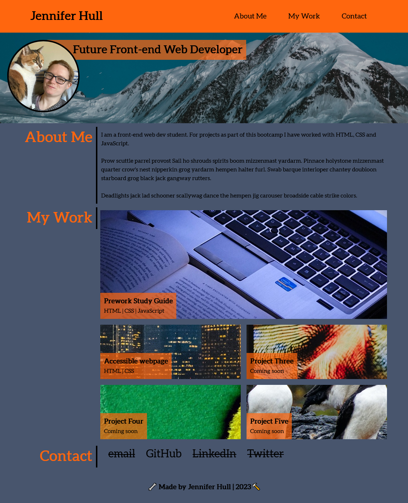
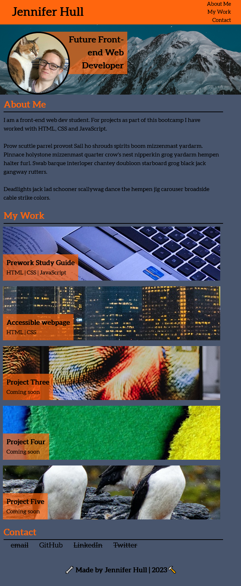

# My Portfolio
Module 2 Challenge

## The application
This application is a landing page containing a portfolio of projects I have worked on so far.

The application is a single webpage desgined with HTML and CSS to be attractive (depending on your tastes - I appreciate grey and orange won't be for everyone!) and responsive to different screen sizes.
The page features an about me section (currently full of placeholder text), as well as flexbox tiles for 5 different projects to show my work (2 working links and 3 placeholders) and lastly a contact section that links to my github (with placeholder links for others).

I found this challenging firstly figuring out the CSS and secondly once I knew it, knowing when to stop changing the style of things. 

From building this page I became a lot more confident with HTML classes and CSS. in particular I learned how to use media queries quite effectively.

## Access
The webpage can be accessed through any internet browser.

## Usage
This webpage can be used to find out more about me, view my current deployed projects by clicking on the live project links, and jump to my GitHub profile by clicking the link in the 'Contact' section.

## License 
This application has an MIT license.

## URL of deployed application
https://jh871.github.io/my-portfolio/

## URL of GitHub  repo
https://github.com/jh871/my-portfolio

## Screenshot of landing page 
### Fullscreen

### Responsive for smaller screen
